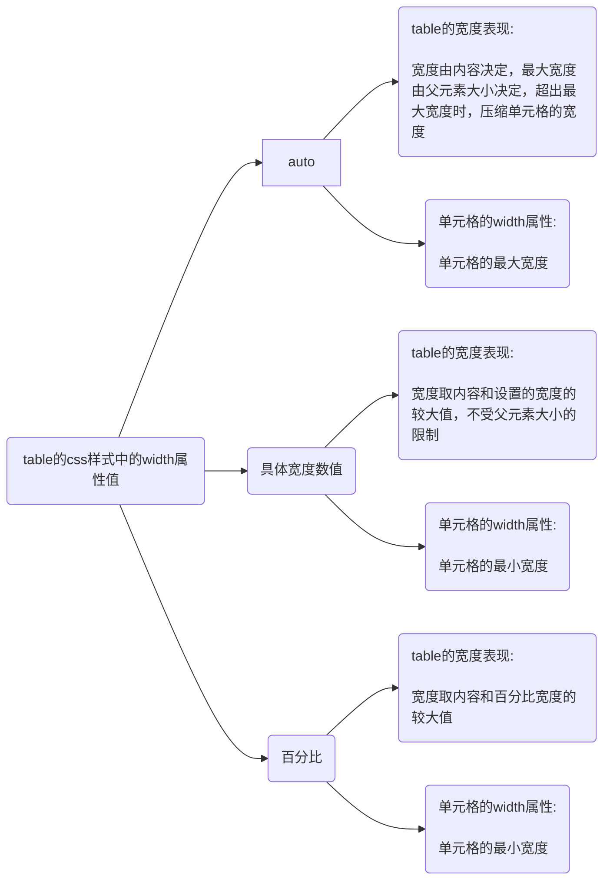

| table的width属性是否为auto | table的宽度表现                                                            | 单元格的width属性 |
| -------------------------- | -------------------------------------------------------------------------- | ----------------- |
| 是                         | 宽度由内容决定，最大宽度由父元素大小决定，超出最大宽度时，压缩单元格的宽度 | 单元格的最大宽度  |
| 否                         | 宽度取内容和设置的宽度的较大值，不受父元素大小的限制                                       | 单元格的最小宽度      |
| 100%                       | 宽度取内容和百分比宽度的较大值                                             | 单元格的最小宽度  |

[测试用例](https://stackblitz.com/edit/js-vfsn4o?file=index.html,index.js,style.css)
