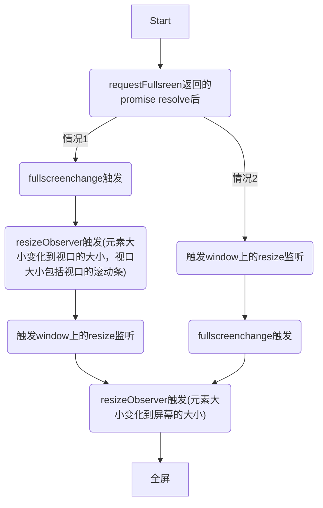

| 问题                                           | 测试结果 |
| ---------------------------------------------- | -------- |
| 什么时候全屏变换结束（包括进入全屏和退出全屏）                           |   window上的resize监听触发时       |
| 是否会触发window的resize事件                   | 触发     |
| 是否会触发这个将要全屏的元素上的resizeObserver | 触发     |
| 执行requestFullscreen时，是否同步                                               |    异步，执行requestFullscreen后添加的fullscreenchange监听事件也会触发      |

元素requestFullscreen后，可能发生的情况：

